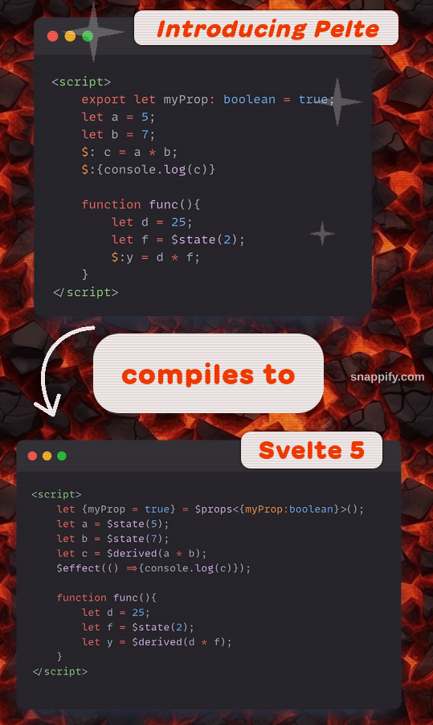

# Signals + let $: = love

I want to convince you that the combination of signals from Svelte 5 and the reactive syntax `let` `$:` is the best combination. And that there is still a chance to save this syntax without any loss.

I personally was very jazzed about the Svelte 5 announcements. I literally love Svelte and Rich Harris became a god to me when I found out that he was the author of Svelte.  
However, the presentation of Svelte 5 caused mixed feelings.

## Two important questions

1. did you happen inside Svelte file to use a `let` that would not be ultimately reactive?
2. did you happen to use something reactive that would not be `let`?

ad 1. Using `let element;` and `bind:this={element}` (and other `bind`). Except that this is somewhat reactive.
ad 2. Using the `const ob = {}` property, which is reactive in Svelte 3/4:

```svelte
<script>
  const ob = {
    a: 1,
    b: 2
  }
</script>
<button on:click={()=>ob.a++}>but</button>
{ob.a}
```

I believe these are the only cases.

The first case will still work in Svelte 5.

The second case is impossible in Svelte 5.

So the statement can be considered true: "We would never use Run, in any other way than we use reactive let $:".

## We never use let, which would not be reactive

This was pointed out by the originator of [Pelte](https://pelte.dev/), in his [blog](https://poxi.substack.com/p/my-thoughts-on-svelte-5-as-a-full?utm_source=profile&utm_medium=reader2) Filip Tangen.  
I recommend reading his arguments.

In order not to lose ANY of the advantages of Svelte 5, he proposed an ordinary preprocessor that converts the `let` `$:` code, into runes from Svelte 5.



(I am leaving out the issue of `export let`, which Pelte also handles).

This is so simple, and so effective.

## What about the Svelte store?

This is where my little contribution comes in.

I wrote a [post](https://www.reddit.com/r/sveltejs/comments/16pvxkx/unification_using_runes_how_about_a_different_way/?utm_source=share&utm_medium=web2x&context=3) on Reddit outlining a simple development of Pelte's idea, with js/ts files.

```svelte
export /* @svelte */ function counter () {
  let count = 0;
  let double;
  $:double = count*2;
  // ...
}
```

Having Svelte 5 and the signals in it, you can easily convert the above code into runes, just as Pelte will convert the Svelte file code.  
Previously, in Svelte 3/4 actually this would not have been possible, so the Signals from Svelte 5 are essential. So it is good that there are signals in Svelte 5.

Every other function works like a simple js/ts function. Reactivity only applies to functions specifically marked, in practice, only the function that is a store creator.

A small discussion developed under the post, in which all doubts were dispelled:

1. "I don't like comments as syntax". - You can use $conter, for example, to mark such functions. This is a contractual issue.
2. "Runes can be used at the top level of the module". - if it's really useful, you need to give the option to mark the top level of the module as reactive. Of course, functions in a module remain simple functions until you also mark it as reactive - this is along the lines of marking functions as `async` or generators. You can nest reactive functions in the same way. You can do exactly the same thing with reactive functions as with runes!
3. "Lack of non-reactive variables will result in unintended behavior of effects and derivatives. It will be difficult to keep track of what is happening and why." - No. If you don't mark the function as reactive, it is exactly a simple function. Nothing bad can happen.

One could elaborate on the doubts, and answer them, but I would like to get through the topic as it is first.

This way we have achieved one of the goals of the run - the same code in the svelte file, and in the js/ts file.

## Notices

Not every Svelte 3/4 code will work in Pelte. Pelte code, it's not exactly Svelte 3/4 code because it uses signals.

## Summary

I am afraid that there is no option to withdraw from the run. That there is no way to preserve the power of let $:. Rich's authoritarianism is too strong, the marketing around Svelte 5 was too much.
That being said, I write this blog post in hopelessness. I don't believe anything can be done yet, even though Svelte 5 doesn't really even exist yet.

I don't want to lose SvelteKit, I don't want to lose Svelte, I don't want to use another framework.

One can always say "it's enough that Pelte will really come into being," but that is poor consolation. I find it hard to accept the current state.
